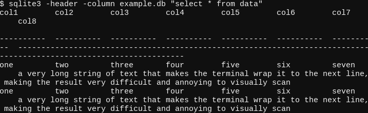
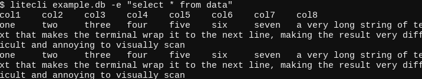

# sqlite viewer
A little python script for running a query against a sqlite database and printing the results.

Created because I got tired of this mess:

and this mess:

this is what the results look like:

## setup
The .py script has a hashbang, so you can symlink it to somewhere on your path like follows:

    $ ln -s ./sqlite-viewer.py ~/.local/bin/sql
    $ chmod +x ~/.local/bin/sql

then simply run it using `sql`:

    $ sql example.db "select * from data"

## usage
Simple usage to run a query against a database:

    sql database command

Shorthand to count the values in a set of columns:

    sql database -count table:columns

Example:

    $ sql example.db -count data:col1,col2

This will expand to this query:

    SELECT col1, col2, count(1) AS count
    FROM data
    GROUP BY col1, col2
    ORDER BY count(10 DESC

I found myself writing a query like this over and over, so I decided to add a quick way of building it into this tool.

I've included the example database from the screenshots, for testing/playing around purposes.
